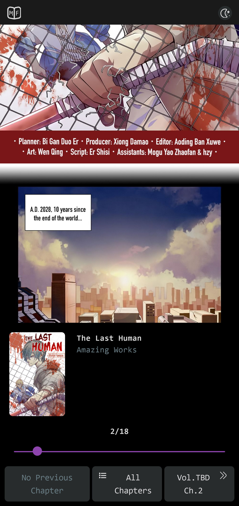

# Manga Fam

A Next js web application to read thousands of mangas and manhwas. This application uses Mangadex public api and tailwind css for styling.
This application is live at [https://manga-fam.vercel.app](https://manga-fam.vercel.app)

## Techstack

This application uses following technologies

- NextJS
- Redux
- Tailwind CSS
- Jest

## Screenshots

The following are the screenshots of the application in desktop and mobile

### Desktop

- Home Page

- Home Page(Light Mode)

- Manga Description Page

- Manga Chapter Page

### Mobile

- Home Page

- Manga Description Page

- Manga Chapter Page

